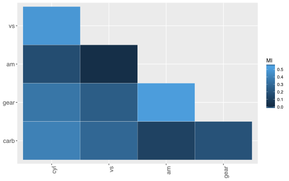

<!-- README.md is generated from README.Rmd. Please edit that file -->

```{r, echo = FALSE}
knitr::opts_chunk$set(
  collapse = TRUE,
  comment = "#>",
  fig.path = "README-"
)
```

# tidyinftheo

[](https://travis-ci.org/pohlio/tidyinftheo)
[](https://codecov.io/gh/pohlio/tidyinftheo)
[](https://ci.appveyor.com/project/pohlio/tidyinftheo)

## Overview
There already exists a great package for information theory measures [@coverthomas], called ["infotheo"](https://cran.r-project.org/web/packages/infotheo/index.html) [@infotheopackage].  **tidyinftheo** wraps around
a few of the functions in the "infotheo" package.  ['Tidy-style'](https://tidyverse.org/) data manipulation in [R](https://cran.r-project.org/).  Some key differences is that this package:

- just calculates Shannon Entropy, Conditional Shannon Entropy, Mutual Information, and Normalized Mutual Information.
- just calculates the "emperical" versions of these measures, as opposed to estimates.
- prefers "bits" (base-2 logs) vs ["nats"](https://en.wikipedia.org/wiki/Nat_(unit)) (natural logs).
- includes a function for aggregating the pairwise comparison of mutual information across more than two variables, yielding a triangular matrix analogous to a [correlation matrix](http://www.statisticshowto.com/correlation-matrix/) for continuous variables.  
- is fairly flexible about the type of the input.  Factors, integers, strings, should all work.  Doubles won't work.    

## Functions

- `shannon_entropy(.data, ..., na.rm=FALSE)`
- `shannon_cond_entropy(.data, ..., na.rm=FALSE)`
- `mutual_info(.data, ..., normalized=FALSE, na.rm=FALSE)`
- `mutual_info_matrix(.data, ..., normalized=FALSE, na.rm=FALSE)`
- `mutual_info_heatmap(mi_matrix, title=NULL, font_sizes=c(12,12))`

## Installation
You can install, the traditional way, from [CRAN](https://cran.r-project.org/) with:
```R
install.packages("tidyinftheo")
```
or if you have the [`devtools`](https://www.rstudio.com/products/rpackages/devtools/) package installed, install `tidyinftheo` from [GitHub](https://github.com/pohlio/tidyinftheo) with:
```R
devtools::install_github("pohlio/tidyinftheo")
```
then load:
```R
library(tidyinftheo)
```
```{r, echo=FALSE, message=FALSE, warning=FALSE, error=FALSE}
devtools::load_all()
```
The GitHub version should still be stable, and may in fact be the same version as CRAN.  Unstable, in-development versions of the package with experimental features will be on other branches of this repository, most notably [the `dev` branch](https://github.com/pohlio/tidyinftheo/tree/dev).  Using branches other than `master` is not recommended unless perhaps you're interested in contributing new features or fixes to the package.  

## Examples

Calculate (in bits) the Shannon Entropy of the eye color variable in the `starwars` dataset:
```{r}
starwars %>% shannon_entropy(eye_color)
```
With the classic `mtcars` dataset, choose some columns to make a matrix of mutual information pairwise comparisons.  In particular, the *cyl*, *vs*, *am*, *gear*, and *carb* columns are all whole numbers indicating they belong to a category.  The other columns are continuous and are better suited to correlation comparisons, unless they're discretized.  Here are the first few rows of **mtcars**:

```{r}
mtcars %>% select(cyl, vs, am, gear, carb) %>% head()
```
And here is our comparison table.  There should be *5-choose-2 = 10* different combinations.  NMI stands for *Normalized Mutual Information*, so the mutual information, normally given in bits, is scaled between 0 and 1:
```{r}
mi_matr <- as_tibble(mtcars) %>% 
    mutate_if(is_double, as.character) %>%
    mutual_info_matrix(cyl, vs, am, gear, carb, normalized=TRUE)
mi_matr
```
The matrix is already in a convenient format to plot:
```R
p <- mutual_info_heatmap(mi_matr)
print(p)
```
<!-- This is annoying, but the auto-generated .svg needs to be in a subdir to be CRAN compliant
     e.g. https://github.com/rstudio/sparklyr/issues/548  -->


NOTE: *The above SVG may or may not render 100% correctly.  Sometimes the legend lacks the color swatch.  This may be a problem with `ggplot2` or web browsers*.  

## References
