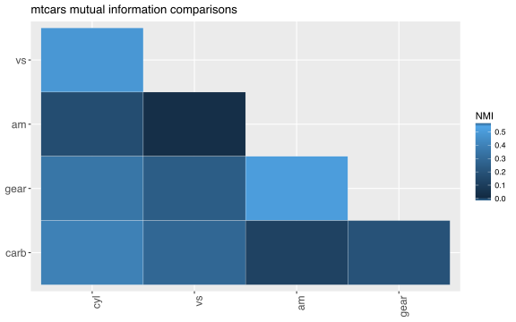

<!-- README.md is generated from README.Rmd. Please edit that file -->
tidyinftheo
===========

[](https://travis-ci.org/pohlio/tidyinftheo) [](https://codecov.io/gh/pohlio/tidyinftheo) [](https://ci.appveyor.com/project/pohlio/tidyinftheo)

Overview
--------

There already exists a great package for information theory measures, called ["infotheo"](https://cran.r-project.org/web/packages/infotheo/index.html). **tidyinftheo** wraps around a few of the functions in the "infotheo" package. ['Tidy-style'](https://tidyverse.org/) data manipulation in [R](https://cran.r-project.org/). Some key differences is that this package:

-   just calculates Shannon Entropy, Conditional Shannon Entropy, Mutual Information, and Normalized Mutual Information.
-   just calculates the "emperical" versions of these measures, as opposed to estimates.
-   prefers "bits" (base-2 logs) vs ["nats"](https://en.wikipedia.org/wiki/Nat_(unit)) (natural logs).
-   includes a function for aggregating the pairwise comparison of mutual information across more than two variables, yielding a triangular matrix analogous to a [correlation matrix](http://www.statisticshowto.com/correlation-matrix/) for continuous variables.
-   is fairly flexible about the type of the input. Factors, integers, strings, should all work. Doubles won't work.

Functions
---------

-   `shannon_entropy(.data, ..., na.rm=FALSE)`
-   `shannon_cond_entropy(.data, ..., na.rm=FALSE)`
-   `mutual_info(.data, ..., normalized=FALSE, na.rm=FALSE)`
-   `mutual_info_matrix(.data, ..., normalized=FALSE, na.rm=FALSE)`

Installation
------------

You can install tidyinftheo from github with:

``` r
devtools::install_github("pohlio/tidyinftheo")
```

Examples
--------

Calculate (in bits) the Shannon Entropy of the eye color variable in the `starwars` dataset:

``` r
library(tidyinftheo)
starwars %>% shannon_entropy(eye_color)
#> Warning in data.matrix(X): NAs introduced by coercion
#> [1] NaN
```

With the classic `mtcars` dataset, choose some columns to make a matrix of mutual information pairwise comparisons. In particular, the *cyl*, *vs*, *am*, *gear*, and *carb* columns are all whole numbers indicating they belong to a category. The other columns are continuous and are better suited to correlation comparisons, unless they're discretized. Here are the first few rows of **mtcars**:

``` r
mtcars %>% select(cyl, vs, am, gear, carb) %>% head()
```

|                   |  cyl|   vs|   am|  gear|  carb|
|-------------------|----:|----:|----:|-----:|-----:|
| Mazda RX4         |    6|    0|    1|     4|     4|
| Mazda RX4 Wag     |    6|    0|    1|     4|     4|
| Datsun 710        |    4|    1|    1|     4|     1|
| Hornet 4 Drive    |    6|    1|    0|     3|     1|
| Hornet Sportabout |    8|    0|    0|     3|     2|
| Valiant           |    6|    1|    0|     3|     1|

And here is our comparison table. There should be *5-choose-2 = 10* different combinations. NMI stands for *Normalized Mutual Information*, so the mutual information, normally given in bits, is scaled between 0 and 1:

``` r
mi_matr <- as_tibble(mtcars) %>% 
    mutate_if(is_double, as.character) %>%
    mutual_info_matrix(cyl, vs, am, gear, carb, normalized=TRUE)
mi_matr
```

| V1   | V2   |         MI|
|:-----|:-----|----------:|
| cyl  | vs   |  0.4937932|
| cyl  | am   |  0.1672528|
| cyl  | gear |  0.3504372|
| cyl  | carb |  0.3983338|
| vs   | am   |  0.0208314|
| vs   | gear |  0.2397666|
| vs   | carb |  0.2861119|
| am   | gear |  0.5173527|
| am   | carb |  0.1149038|
| gear | carb |  0.1905054|

The matrix is already in a convenient format to plot:

``` r
axis_names <- mtcars %>% select(cyl, vs, am, gear, carb) %>% names()
p <- mi_matr %>%
    ggplot(aes(V1, V2)) +
    geom_tile(aes(fill=MI), color="white") +
    scale_x_discrete(limits=axis_names[1:(length(axis_names)-1)]) +
    scale_y_discrete(limits=rev(axis_names)[1:(length(axis_names)-1)]) +
    scale_fill_continuous(limits=c(0,0.6)) + 
    theme(axis.text.x=element_text(angle=90, hjust=1, size=12),
          axis.text.y=element_text(size=12)) +
    xlab(NULL) + ylab(NULL) + 
    ggtitle("mtcars mutual information comparisons")
print(p)
```


